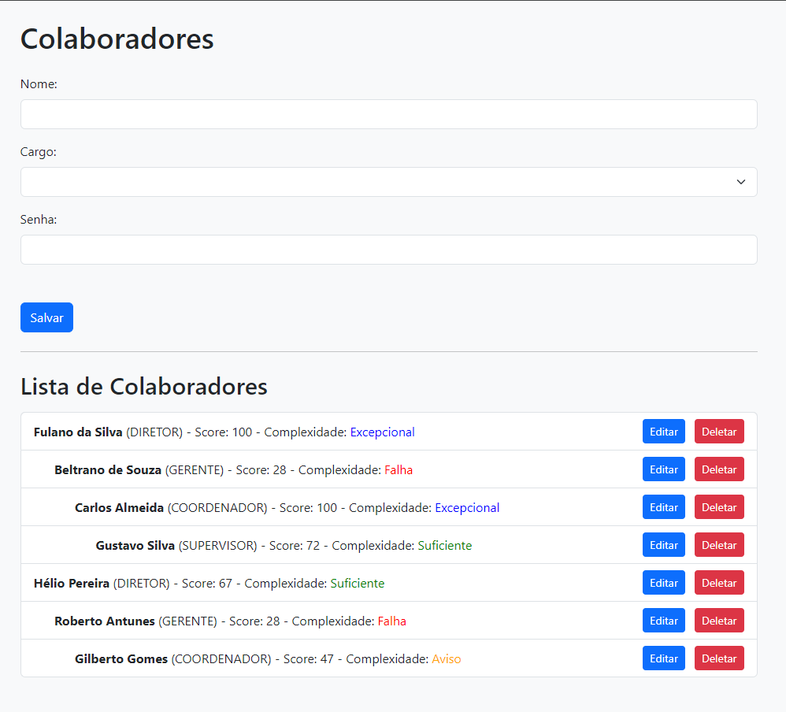
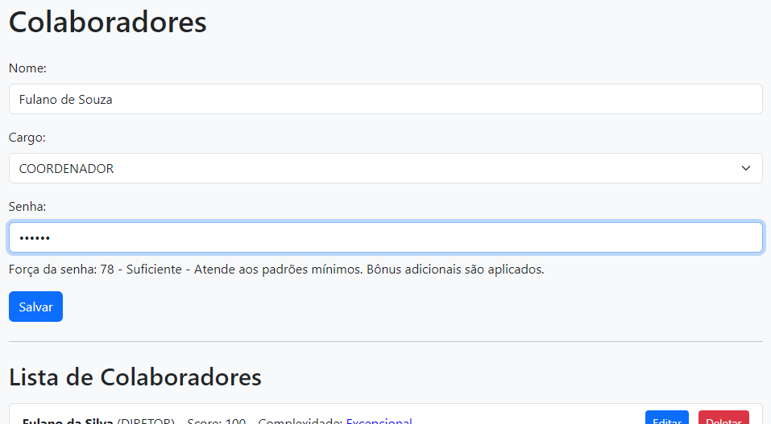

# Projeto Colaborador App

Este projeto consiste em uma aplicação web para gerenciar colaboradores, desenvolvida com um backend em Java (versão 17) utilizando o ecossistema Spring e um frontend em AngularJS (versão 1).

## Funcionalidades

- **Cadastro de Colaboradores:** Os usuários podem adicionar novos colaboradores, informando seu nome, cargo e senha.
- **Listagem de Colaboradores:** A lista de colaboradores cadastrados é exibida, mostrando o nome, cargo, pontuação da senha e complexidade.
- **Edição de Colaboradores:** Os usuários podem editar as informações de um colaborador existente.
- **Exclusão de Colaboradores:** É possível excluir um colaborador da lista.
- **Validação de Senha em Tempo Real:** Ao cadastrar ou editar um colaborador, a força da senha é avaliada em tempo real e exibida ao lado do registro após salvo nna lista.

## Backend Java (Spring)

O backend da aplicação foi desenvolvido em Java utilizando o ecossistema Spring. Ele fornece endpoints RESTful para manipulação dos dados dos colaboradores, incluindo operações de criação, leitura, atualização e exclusão (CRUD). Além disso, o backend realiza a validação da senha em tempo real.

## Frontend AngularJS

O frontend da aplicação foi desenvolvido em AngularJS (versão 1), proporcionando uma experiência de usuário dinâmica e interativa. Ele se comunica com o backend por meio de requisições HTTP para obter e manipular os dados dos colaboradores.

## Instruções de Execução

Para executar a aplicação localmente, siga os passos abaixo:

1. Certifique-se de ter o Java JDK (versão 17) instalado em sua máquina.
2. Certifique-se de ter banco de dados MySQL ativo, com o banco de nome indicado em "application.properties" criado. Tabelas serão criadas pela instrução SQL contida na pasta resources/db.
3. O index do frontend pode ser aberto diretamente no browser ou executado à partir de live server.

Com essas etapas concluídas, você poderá acessar a aplicação em seu navegador e começar a gerenciar os colaboradores. Em caso de dúvidas, fico à disposição.

